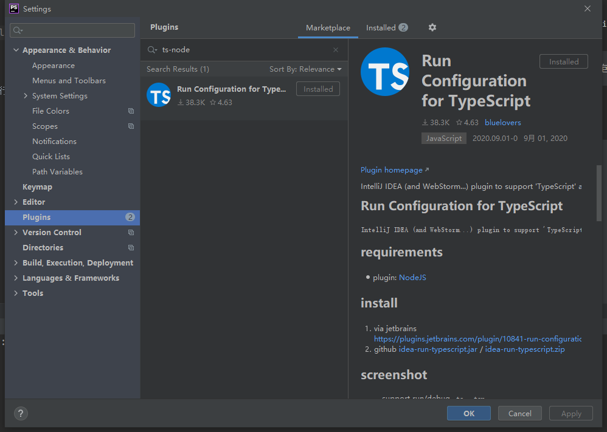
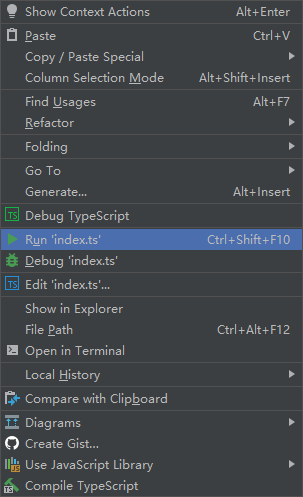

>ts编译依赖nodejs，一下内容建立在已经安装nodejs的前提之下
1：安装ts:

```

 npm install -g typescript

```

2：安装直接运行所需依赖包： 

```

npm install -g ts-node

```

3：在phpstorm中设置中安装安装插件后重启



4、npm init 创建项目，可以一路回车，最后 ` "main": "index.js" ` 改为 `  "main": "index.ts" `  

```

{
  "name": "learn-ts",
  "version": "1.0.0",
  "description": "乐编码",
  "main": "index.ts",
  "scripts": {
    "test": "echo \"Error: no test specified\" && exit 1"
  },
  "keywords": [
    "乐编码-ts，typescript"
  ],
  "author": "",
  "license": "ISC"
}


```


5、 创建index.ts

```

console.log('Hello World')

```

5、 运行index.ts



#### 欢迎大家关注我的公众号： **乐编码**


